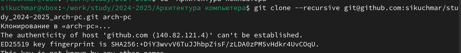

---
## Front matter
title: "Лабораторная работа №2"
subtitle: "Архитектура компьютера"
author: "Кучмар София Игоревна"

## Generic otions
lang: ru-RU
toc-title: "Содержание"

## Bibliography
bibliography: bib/cite.bib
csl: pandoc/csl/gost-r-7-0-5-2008-numeric.csl

## Pdf output format
toc: true # Table of contents
toc-depth: 2
fontsize: 12pt
linestretch: 1.5
papersize: a4
documentclass: scrreprt
## I18n polyglossia
polyglossia-lang:
  name: russian
  options:
	- spelling=modern
	- babelshorthands=true
polyglossia-otherlangs:
  name: english
## I18n babel
babel-lang: russian
babel-otherlangs: english
## Fonts
mainfont: IBM Plex Serif
romanfont: IBM Plex Serif
sansfont: IBM Plex Sans
monofont: IBM Plex Mono
mathfont: STIX Two Math
mainfontoptions: Ligatures=Common,Ligatures=TeX,Scale=0.94
romanfontoptions: Ligatures=Common,Ligatures=TeX,Scale=0.94
sansfontoptions: Ligatures=Common,Ligatures=TeX,Scale=MatchLowercase,Scale=0.94
monofontoptions: Scale=MatchLowercase,Scale=0.94,FakeStretch=0.9
mathfontoptions:
## Biblatex
biblatex: true
biblio-style: "gost-numeric"
biblatexoptions:
  - parentracker=true
  - backend=biber
  - hyperref=auto
  - language=auto
  - autolang=other*
  - citestyle=gost-numeric
## Pandoc-crossref LaTeX customization
figureTitle: "Рис."
tableTitle: "Таблица"

## Misc options
indent: true
header-includes:
  - \usepackage{indentfirst}
  - \usepackage{float} # keep figures where there are in the text
  - \floatplacement{figure}{H} # keep figures where there are in the text
---

# Цель работы

Эта работа направлена на развитие практических навыков работы с системой Git. Мы изучим основные принципы контроля версий и получим практический опыт работы с инструментами Git.

# Задание

Работа посвящена практическому освоению системы контроля версий Git и платформы GitHub, необходимых для эффективного управления кодом и организации совместной работы над проектами.

В рамках данного практикума будет осуществлена пошаговая настройка необходимых инструментов: будет освоена процедура установки и конфигурации Git на персональном компьютере, создан SSH ключ для безопасного подключения к платформе GitHub без необходимости постоянного ввода пароля, осуществлена регистрация на платформе GitHub, создана локальная копия (рабочее пространство) и репозиторий курса на платформе GitHub, осуществлена настройка каталога курса, обеспечивающая порядок и удобство работы с проектом.

По завершении работы будут получены базовые навыки работы с Git и GitHub, необходимые для эффективного участия в командной разработке проектов.

# Выполнение лабораторной работы

Создадим учётную запись на сайте https://github.com/ и заполним основные данные (рис. [-@fig:101]).

{#fig:101 width=70%}

Сначала сделаем предварительную конфигурацию git. Откроем терминал и введём следующие команды, указав имя и email (рис. [-@fig:102]).

{#fig:102 width=70%}

Настроим utf-8 в выводе сообщений git и зададим имя начальной ветки (назовём её master) (рис. [-@fig:103]).

{#fig:103 width=70%}

Настроим параметры autocrlf и safecrlf (рис. [-@fig:104]).

{#fig:104 width=70%}

Для последующей идентификации пользователя на сервере репозиториев необходимо сгенерировать пару ключей (приватный и открытый) (рис. [-@fig:105]).

{#fig:105 width=70%}

Скопируем из локальной консоли ключ в буфер обмена (рис. [-@fig:106]).

{#fig:106 width=70%}

Далее загрузим сгенерированный открытый ключ на github (рис. [-@fig:107]).

{#fig:107 width=70%}

Создадим каталог для предмета «Архитектура компьютера» (рис. [-@fig:108]).

{#fig:108 width=70%}

Перейдём на станицу репозитория с шаблоном курса и создадим репозиторий study_2023–2024_arh-pc (рис. [-@fig:109]).

{#fig:109 width=70%}

Перейдём в каталог курса и клонируем созданный репозиторий (рис. [-@fig:110]).

{#fig:110 width=70%}

Перейдём в каталог курса и удалим лишние файлы (рис. [-@fig:111]).

{#fig:111 width=70%}

Создадим необходимые каталоги (рис. [-@fig:112]).

{#fig:112 width=70%}

Отправим файлы на сервер (рис. [-@fig:113]) и (рис. [-@fig:114]).

{#fig:113 width=70%}

{#fig:114 width=70%}

Проверим правильность создания иерархии рабочего пространства в локальном
репозитории (рис. [-@fig:115]) и на странице github (рис. [-@fig:116]).

{#fig:115 width=70%}

{#fig:116 width=70%}

Создадим отчет по выполнению лабораторной работы в соответствующем каталоге рабочего пространства (labs>lab02>report) (рис. [-@fig:117]).

{#fig:117 width=70%}

Перенесём отчеты по выполнению предыдущих лабораторных работ в соответствующие каталоги созданного рабочего пространства (рис. [-@fig:118]).

{#fig:118 width=70%}

Загрузим файлы на github (рис. [-@fig:119]).

{#fig:119 width=70%} 

# Выводы

В ходе данного практикума была успешно освоена система контроля версий Git и платформа GitHub. Студенты получили практические навыки работы с Git, включая установку и конфигурацию системы, создание SSH ключа для безопасного
подключения к GitHub, регистрацию на платформе, создание локальной копии репозитория и настройку каталога курса.

