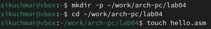
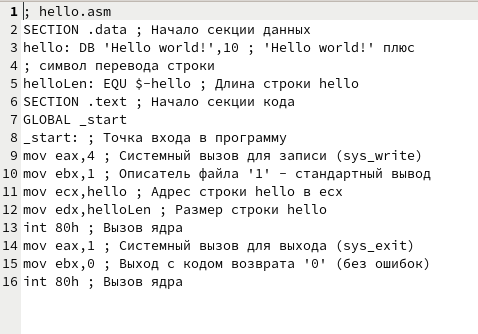
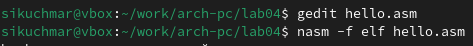
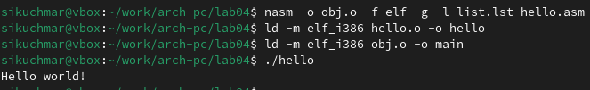
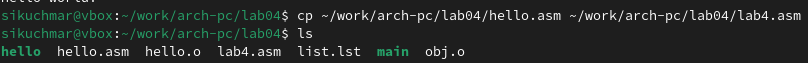
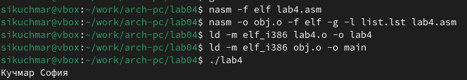
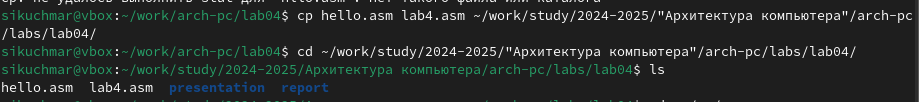
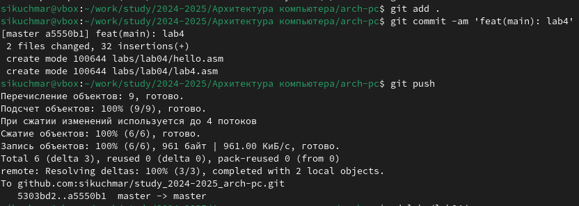

---
## Front matter
title: "Лабораторная работа №4"
subtitle: "Архитектура компьютера"
author: "Кучмар София Игоревна"

## Generic otions
lang: ru-RU
toc-title: "Содержание"

## Bibliography
bibliography: bib/cite.bib
csl: pandoc/csl/gost-r-7-0-5-2008-numeric.csl

## Pdf output format
toc: true # Table of contents
toc-depth: 2
fontsize: 12pt
linestretch: 1.5
papersize: a4
documentclass: scrreprt
## I18n polyglossia
polyglossia-lang:
  name: russian
  options:
	- spelling=modern
	- babelshorthands=true
polyglossia-otherlangs:
  name: english
## I18n babel
babel-lang: russian
babel-otherlangs: english
## Fonts
mainfont: IBM Plex Serif
romanfont: IBM Plex Serif
sansfont: IBM Plex Sans
monofont: IBM Plex Mono
mathfont: STIX Two Math
mainfontoptions: Ligatures=Common,Ligatures=TeX,Scale=0.94
romanfontoptions: Ligatures=Common,Ligatures=TeX,Scale=0.94
sansfontoptions: Ligatures=Common,Ligatures=TeX,Scale=MatchLowercase,Scale=0.94
monofontoptions: Scale=MatchLowercase,Scale=0.94,FakeStretch=0.9
mathfontoptions:
## Biblatex
biblatex: true
biblio-style: "gost-numeric"
biblatexoptions:
  - parentracker=true
  - backend=biber
  - hyperref=auto
  - language=auto
  - autolang=other*
  - citestyle=gost-numeric
## Pandoc-crossref LaTeX customization
figureTitle: "Рис."
tableTitle: "Таблица"

## Misc options
indent: true
header-includes:
  - \usepackage{indentfirst}
  - \usepackage{float} # keep figures where there are in the text
  - \floatplacement{figure}{H} # keep figures where there are in the text
---

# Цель работы

Эта работа направлена на освоение процедур компиляции и сборки программ, написанных на ассемблере NASM, с использованием практических примеров и задач. 

# Задание

Данная работа посвящена практическому освоению основ работы с ассемблером NASM.В рамках данной работы студенты познакомятся с основными принципами работы компьютера, ассемблером и языком ассемблера. Они изучат процесс создания и обработки программ на языке ассемблера, начиная от написания кода до запуска исполняемого файла. 

# Выполнение лабораторной работы

Создаём каталог для работы с программами на языке ассемблера NASM, переходим туда и создаём текстовый файл с именем hello.asm (рис. [-@fig:101]).

{#fig:101 width=70%}

Открываем этот файл с помощью текстового редактора gedit и пишем текст(рис. [-@fig:102]).

{#fig:102 width=70%}

С помощью NASM преобразовывем текст файла в объектный код, который запишется в файл hello.o (рис. [-@fig:103]), компилируем исходный файл в obj.o, передаём на обработку компановщику и запускаем исполняемый файл (рис. [-@fig:104]).

{#fig:103 width=70%}

{#fig:104 width=70%}

В каталоге ~/work/arch-pc/lab04 с помощью команды cp создадим копию файла hello.asm с именем lab4.asm (рис. [-@fig:105]) и отредактируем файл, чтобы вместо Hello world! на экран выводилась строка с фамилией и именем (рис. [-@fig:106]).

{#fig:105 width=70%}

{#fig:106 width=70%}

Оттранслируем полученный текст программы lab4.asm в объектный файл. Выполним компоновку объектного файла и запустим получившийся исполняемый файл (рис. [-@fig:107]).

{#fig:107 width=70%}

Скопируем файлы hello.asm и lab4.asm в локальный репозиторий в каталог ~/work/study/2023-2024/"Архитектура компьютера"/arch-pc/labs/lab04/ (рис. [-@fig:108]) и загрузем файлы на Github (рис. [-@fig:109]).

{#fig:108 width=70%}

{#fig:109 width=70%}

# Выводы

В рамках данной работы были успешно освоены основы работы с ассемблером NASM, изучены синтаксис и функциональность транслятора NASM, простой ассемблерный код и использование NASM для его компиляции. Были освоены работы с компоновщиком LD, который объединяет отдельные модули кода в единый исполняемый файл.

