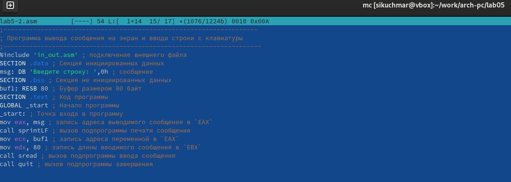
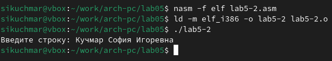

---
## Front matter
title: "Лабораторная работа №5"
subtitle: "Архитектура компьютера"
author: "Кучмар София Игоревна"

## Generic otions
lang: ru-RU
toc-title: "Содержание"

## Bibliography
bibliography: bib/cite.bib
csl: pandoc/csl/gost-r-7-0-5-2008-numeric.csl

## Pdf output format
toc: true # Table of contents
toc-depth: 2
fontsize: 12pt
linestretch: 1.5
papersize: a4
documentclass: scrreprt
## I18n polyglossia
polyglossia-lang:
  name: russian
  options:
	- spelling=modern
	- babelshorthands=true
polyglossia-otherlangs:
  name: english
## I18n babel
babel-lang: russian
babel-otherlangs: english
## Fonts
mainfont: IBM Plex Serif
romanfont: IBM Plex Serif
sansfont: IBM Plex Sans
monofont: IBM Plex Mono
mathfont: STIX Two Math
mainfontoptions: Ligatures=Common,Ligatures=TeX,Scale=0.94
romanfontoptions: Ligatures=Common,Ligatures=TeX,Scale=0.94
sansfontoptions: Ligatures=Common,Ligatures=TeX,Scale=MatchLowercase,Scale=0.94
monofontoptions: Scale=MatchLowercase,Scale=0.94,FakeStretch=0.9
mathfontoptions:
## Biblatex
biblatex: true
biblio-style: "gost-numeric"
biblatexoptions:
  - parentracker=true
  - backend=biber
  - hyperref=auto
  - language=auto
  - autolang=other*
  - citestyle=gost-numeric
## Pandoc-crossref LaTeX customization
figureTitle: "Рис."
tableTitle: "Таблица"

## Misc options
indent: true
header-includes:
  - \usepackage{indentfirst}
  - \usepackage{float} # keep figures where there are in the text
  - \floatplacement{figure}{H} # keep figures where there are in the text
---

# Цель работы

Эта работа направлена на освоение приобретение практических навыков работы в Midnight Commander. Освоение инструкций языка ассемблера mov и int.

# Задание

Данная работа посвящена практическому освоению ассемблера NASM и файлового менеджера Midnight Commander. Будут изучены основы работы с Midnight Commander, освоена навигация по файловой системе, редактирование файлов, операции копирования, перемещения и удаления файлов, с основами структуры программы на языке ассемблера NASM, основными директивами ассемблера, инструкциями mov, add, sub, jmp и напишут программу с использованием системных вызовов. Будет подключен внешний файл in_out.asm с функциями ввода и вывода данных, и написана программу вывода сообщения на экран и ввода строки с клавиатуры с использованием этих функций.

# Выполнение лабораторной работы

Откроем Midnight Commander, перейдём в каталог ~/work/arch-pc созданный при выполнении лабораторной работы №4 и создадим папку lab05(рис. [-@fig:101]).

{#fig:101 width=70%}

Пользуясь строкой ввода и командой touch создайте файл lab5-1.asm (рис. [-@fig:102]).

{#fig:102 width=70%}

Откроем файл lab5-1.asm для редактирования во встроенном редакторе, введём текст программы, cохраним и закроем файл (рис. [-@fig:103]) откроем файл lab5-1.asm для просмотра и убедимся, что файл содержит текст программы. (рис. [-@fig:104]).

{#fig:103 width=70%}

{#fig:104 width=70%}

Оттранслируем текст программы lab5-1.asm в объектный файл. Выполним компоновку объектного файла и запустим получившийся исполняемый файл. Программа выводит строку 'Введите строку:' и ожидает ввода с клавиатуры. На запрос введём ФИО. (рис. [-@fig:105]) 

{#fig:105 width=70%}

Скачаем файл in_out.asm со страницы курса в ТУИС и скопируем в нужную папку (рис. [-@fig:106]).

{#fig:106 width=70%}

Создадим копию файла lab5-1.asm с именем lab5-2.asm. (рис. [-@fig:107]).

{#fig:107 width=70%}

Исправим текст программы в файле lab5-2.asm с использованием подпрограмм из внешнего файла in_out.asm (рис. [-@fig:108])

{#fig:108 width=70%}

Создадим исполняемый файл и проверим его работу (рис. [-@fig:109]).

{#fig:109 width=70%}

В файле lab5-2.asm заменим подпрограмму sprintLF на sprint. Создадим исполняемый файл и проверим его работу (рис. [-@fig:110]).

{#fig:110 width=70%}

Создадим копию файла lab5-1.asm. Внесём изменения в программу (без использования внешнего файла in_out.asm), так чтобы она в конце выводила написанную с клавиатуры строчку (рис. [-@fig:111]).

{#fig:111 width=70%}

Создайдим копию файла lab5-2.asm. Исправим текст программы с использованием подпрограмм из внешнего файла in_out.asm с тем же алгоритмом (рис. [-@fig:112]).

{#fig:112 width=70%}

# Выводы

В рамках данной работы были успешно освоены основы работы с ассемблером NASM и файловым менеджером Midnight Commander. Были изучены процессы оперирования файлами, редактирования код, перемещения по файловой системе.

