---
## Front matter
title: "Лабораторная работа №6"
subtitle: "Архитектура компьютера"
author: "Кучмар София Игоревна"

## Generic otions
lang: ru-RU
toc-title: "Содержание"

## Bibliography
bibliography: bib/cite.bib
csl: pandoc/csl/gost-r-7-0-5-2008-numeric.csl

## Pdf output format
toc: true # Table of contents
toc-depth: 2
fontsize: 12pt
linestretch: 1.5
papersize: a4
documentclass: scrreprt
## I18n polyglossia
polyglossia-lang:
  name: russian
  options:
	- spelling=modern
	- babelshorthands=true
polyglossia-otherlangs:
  name: english
## I18n babel
babel-lang: russian
babel-otherlangs: english
## Fonts
mainfont: IBM Plex Serif
romanfont: IBM Plex Serif
sansfont: IBM Plex Sans
monofont: IBM Plex Mono
mathfont: STIX Two Math
mainfontoptions: Ligatures=Common,Ligatures=TeX,Scale=0.94
romanfontoptions: Ligatures=Common,Ligatures=TeX,Scale=0.94
sansfontoptions: Ligatures=Common,Ligatures=TeX,Scale=MatchLowercase,Scale=0.94
monofontoptions: Scale=MatchLowercase,Scale=0.94,FakeStretch=0.9
mathfontoptions:
## Biblatex
biblatex: true
biblio-style: "gost-numeric"
biblatexoptions:
  - parentracker=true
  - backend=biber
  - hyperref=auto
  - language=auto
  - autolang=other*
  - citestyle=gost-numeric
## Pandoc-crossref LaTeX customization
figureTitle: "Рис."
tableTitle: "Таблица"

## Misc options
indent: true
header-includes:
  - \usepackage{indentfirst}
  - \usepackage{float} # keep figures where there are in the text
  - \floatplacement{figure}{H} # keep figures where there are in the text
---

# Цель работы

Эта работа направлена на освоение арифметических инструкций языка ассемблера NASM.

# Задание

Данная работа посвящена практическому освоению ассемблера NASM. Будут изучены основы работы адресацией в NASM, освоены арифметические операции в NASM, целочисленное сложение add, целочисленное вычитание sub, команды инкремента и декремента, команда изменения знака операнда neg, основными директивами ассемблера, команды умножения mul и imul и будет написана программу для вычисления выражений. Будет подключен внешний файл in_out.asm с функциями ввода и вывода данных.

# Выполнение лабораторной работы

Создадим каталог для программам лабораторной работы № 6, перейдём в него и создадим файл lab6-1.asm(рис. [-@fig:101]).

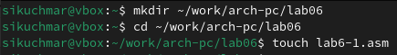{#fig:101 width=70%}

Рассмотрим примеры программ вывода символьных и численных значений. Программы будут выводить значения записанные в регистр eax (рис. [-@fig:102]).

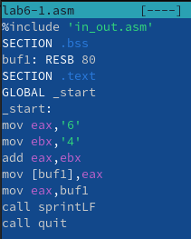{#fig:102 width=70%}

Создадим исполняемый файл и запустим его (рис. [-@fig:103]). 

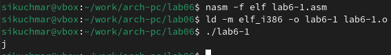{#fig:103 width=70%}

Далее изменим текст программы и вместо символов, запишем в регистры числа. Исправим текст программы (рис. [-@fig:104]).

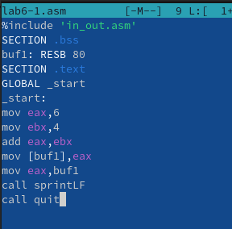{#fig:104 width=70%}

Создадим исполняемый файл и запустим его (рис. [-@fig:105]) 

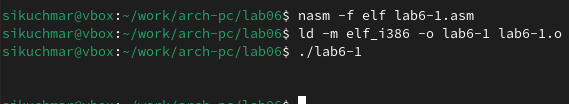{#fig:105 width=70%}

Создадим файл lab6-2.asm в каталоге ~/work/arch-pc/lab06 и введём в него текст программы. Создадим исполняемый файл и запустим его (рис. [-@fig:106]).

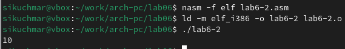{#fig:106 width=70%}

Аналогично предыдущему примеру изменим символы на числа. Создадим исполняемый файл и запустим его (рис. [-@fig:107]).

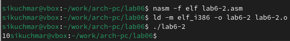{#fig:107 width=70%}

Создадим файл lab6-3.asm в каталоге ~/work/arch-pc/lab06 и введём в него текст программы (рис. [-@fig:108]).

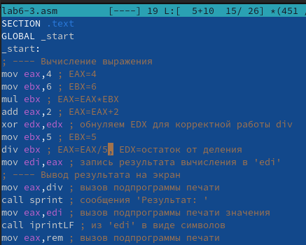{#fig:108 width=70%}

Создадим исполняемый файл и запустим его (рис. [-@fig:109]).

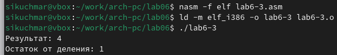{#fig:109 width=70%}

Изменим текст программы для вычисления выражения f(x)=(4∗6+2)/5. Создадим исполняемый файл и запустим его (рис. [-@fig:110]).

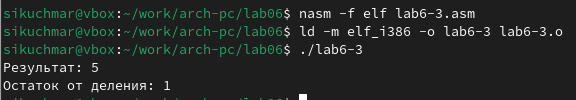{#fig:110 width=70%}

Создадим файл variant.asm в каталоге ~/work/arch-pc/lab06 и введём в него текст программы/ Создадим исполняемый файл и запустим его (рис. [-@fig:111]).

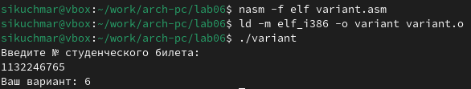{#fig:111 width=70%}

Заметим, что 
1. Строки отвечающие за вывод на экран сообщения ‘Ваш вариант: mov eax, rem call sprintLF 
2. Инструкции mov ecx, x, mov edx, 80, call sread используются для чтения строки (в данном случае номера студенческого билета) из стандартного ввода. ecx указывает на буфер x, edx — на количество байтов для чтения, а sread считывает строку из стандартного ввода и сохраняет ее в буфере. 
3. Инструкция “call atoi” используется для преобразования строки, хранящейся в x, в целое число. Преобразованное число сохраняется в регистре eax. 
4. Строки, отвечающие за вычисления варианта: xor edx,edx mov ebx,20 div ebx inc edx
5. В регистр edx записывается остаток от деления при выполнении инструкции “div ebx”
6. Инструкция “inc edx” используется для увеличения остатка от деления на 1. Это необходимо, так как номера вариантов нумеруются с 1, а деление на 20 дает остаток от 0 до 19.
7. Строки, отвечающие за вывод на экран результата вычислений: mov eax,rem call sprint mov eax,edx call iprintLF

Создадим файл lab5-4.asm в каталоге ~/work/arch-pc/lab06 и введём в него текст программы (рис. [-@fig:112]).

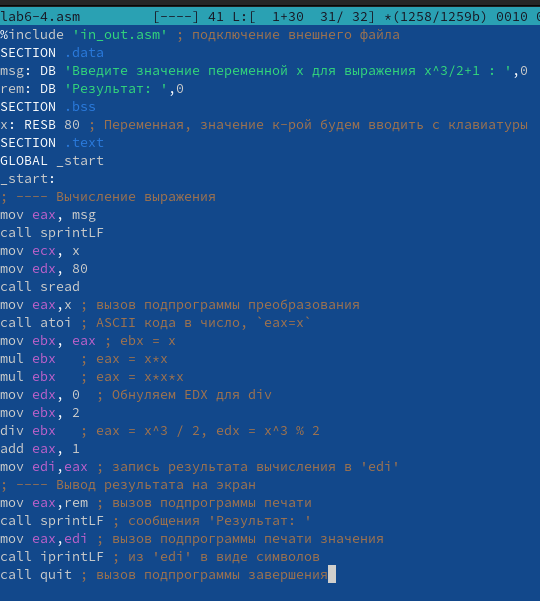{#fig:112 width=70%}

Создадим исполняемый файл и запустим его (рис. [-@fig:113]).

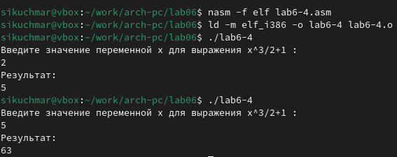{#fig:113 width=70%}

# Выводы

В рамках данной работы были успешно освоены основы работы с ассемблером NASM. Были освоены арифметические операции в NASM и создание программ для вычисления выражений.

