---
## Front matter
title: "Лабораторная работа №7"
subtitle: "Архитектура компьютера"
author: "Кучмар София Игоревна"

## Generic otions
lang: ru-RU
toc-title: "Содержание"

## Bibliography
bibliography: bib/cite.bib
csl: pandoc/csl/gost-r-7-0-5-2008-numeric.csl

## Pdf output format
toc: true # Table of contents
toc-depth: 2
fontsize: 12pt
linestretch: 1.5
papersize: a4
documentclass: scrreprt
## I18n polyglossia
polyglossia-lang:
  name: russian
  options:
	- spelling=modern
	- babelshorthands=true
polyglossia-otherlangs:
  name: english
## I18n babel
babel-lang: russian
babel-otherlangs: english
## Fonts
mainfont: IBM Plex Serif
romanfont: IBM Plex Serif
sansfont: IBM Plex Sans
monofont: IBM Plex Mono
mathfont: STIX Two Math
mainfontoptions: Ligatures=Common,Ligatures=TeX,Scale=0.94
romanfontoptions: Ligatures=Common,Ligatures=TeX,Scale=0.94
sansfontoptions: Ligatures=Common,Ligatures=TeX,Scale=MatchLowercase,Scale=0.94
monofontoptions: Scale=MatchLowercase,Scale=0.94,FakeStretch=0.9
mathfontoptions:
## Biblatex
biblatex: true
biblio-style: "gost-numeric"
biblatexoptions:
  - parentracker=true
  - backend=biber
  - hyperref=auto
  - language=auto
  - autolang=other*
  - citestyle=gost-numeric
## Pandoc-crossref LaTeX customization
figureTitle: "Рис."
tableTitle: "Таблица"

## Misc options
indent: true
header-includes:
  - \usepackage{indentfirst}
  - \usepackage{float} # keep figures where there are in the text
  - \floatplacement{figure}{H} # keep figures where there are in the text
---

# Цель работы

Эта работа направлена на изучение команд условного и безусловного переходов, приобретение навыков написания
программ с использованием инструкции jmp, знакомство с назначением и структурой файла листинга, команд условного перехода, инструкции cmp.

# Задание

Данная работа посвящена практическому освоению ассемблера NASM. Будут изучены основы работы адресацией в NASM, освоены арифметические операции в NASM, целочисленное сложение add, целочисленное вычитание sub, команды инкремента и декремента, команда изменения знака операнда neg, основными директивами ассемблера, команды умножения mul и imul и будет написана программу для вычисления выражений с использованием инструкции jmp и программа, которая определяет и выводит на экран наибольшую/ наименьшую из 3 целочисленных переменных: A,B и C. Будет подключен внешний файл in_out.asm с функциями ввода и вывода данных.

# Выполнение лабораторной работы

Создадим каталог для программам лабораторной работы № 7, перейдём в него и создадим файл lab6-1.asm(рис. [-@fig:101]).

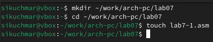{#fig:101 width=70%}

Рассмотрим пример программы с использованием инструкции jmp (рис. [-@fig:102]).

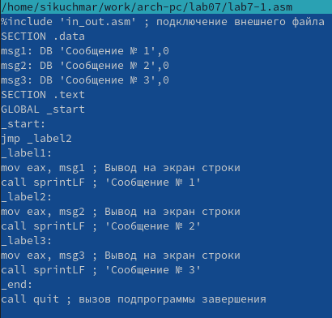{#fig:102 width=70%}

Создадим исполняемый файл и запустим его (рис. [-@fig:103]). 

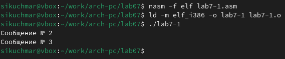{#fig:103 width=70%}

Изменим программу таким образом, чтобы она выводила сначала ‘Сообщение № 2’, потом ‘Сообщение № 1’ и завершала работу. Для этого в текст программы после вывода сообщения № 2 добавим инструкцию jmp с меткой _label1 и после вывода сообщения № 1 добавим инструкцию jmp с меткой _end(рис. [-@fig:104]).

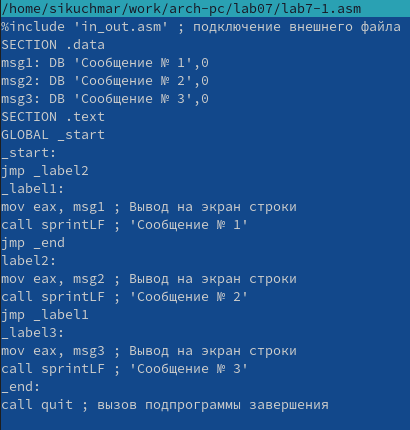{#fig:104 width=70%}

Создадим исполняемый файл и запустим его (рис. [-@fig:105]) 

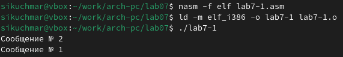{#fig:105 width=70%}

Изменим текст программы добавив или изменив инструкции jmp, чтобы вывод программы был следующим: сначала ‘Сообщение № 3’, ‘Сообщение № 2’, потом ‘Сообщение № 1’ и завершала работу. (рис. [-@fig:106]).

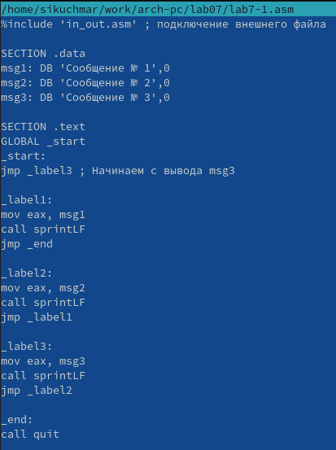{#fig:106 width=70%}

 Создадим исполняемый файл и запустим его (рис. [-@fig:107]).

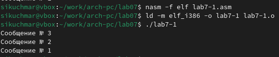{#fig:107 width=70%}

Создадим файл lab7-2.asm в каталоге ~/work/arch-pc/lab07 и создадим программу, которая определяет и выводит на экран наибольшую из 3 целочисленных переменных: A,B и C. Значения для A и C задаются в программе, значение B вводиться с клавиатуры. (рис. [-@fig:108]).

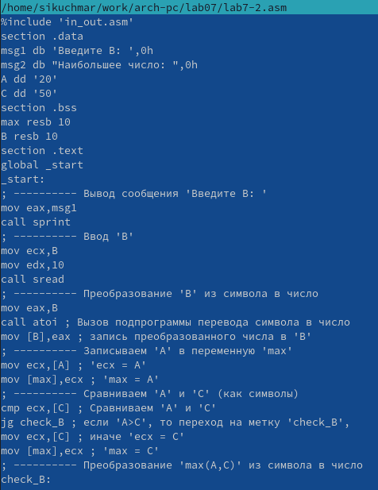{#fig:108 width=70%}

Создадим исполняемый файл и проверим его работу для разных значений B (рис. [-@fig:109]).

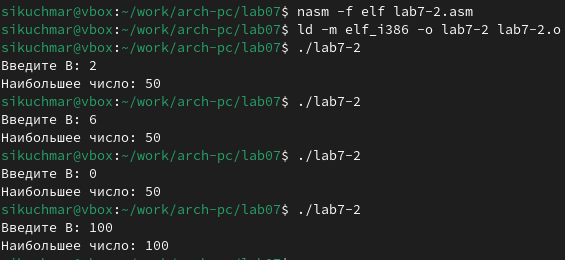{#fig:109 width=70%}

Обычно nasm создаёт в результате ассемблирования только объектный файл. Получить файл листинга можно, указав ключ -l и задав имя файла листинга в командной строке. Создадим файл листинга для программы из файла lab7-2.asm(рис. [-@fig:110]). Откроем файл листинга lab7-2.lst с помощью любого текстового редактора. Внимательно ознакомиться с его форматом и содержимым. Например:
Строка 8: cmp byte [eax], 0 сравнивает байт по адресу eax с нулем, проверяя конец строки (нуль-терминатор).

Строка 14: sub eax, ebx вычисляет длину строки, вычитая начальный адрес (ebx) из конечного (eax).

Строка 27: call slen вызывает функцию slen для определения длины строки.

Давайте удалим один операнд из инструкции в строке 27.  Например, удалим slen. В результате будут созданы два файла lab7-2.o : объектный файл, содержащий машинный код и lab7-2.lst: листинговый файл.В листинговом файле в строке 27 мы увидим сообщение об ошибке от ассемблера.  Ассемблер не сможет корректно собрать программу, так как инструкция call требует операнда.

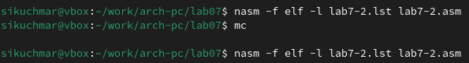{#fig:110 width=70%}

Напишем программу нахождения наименьшей из 3 целочисленных переменных a,b и с. (рис. [-@fig:111]).

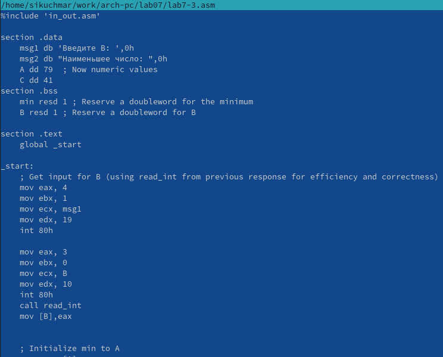{#fig:111 width=70%}

Создадим исполняемый файл и запустим его для значений Варианта 6: a=79, b=83, c=41 (рис. [-@fig:112]).

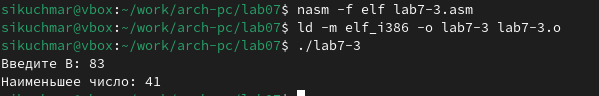{#fig:112 width=70%}

Напишем программу, которая для введенных с клавиатуры значений x и a вычисляет значение заданной функции x+a, при x не = а, 5x, при x=a и выводит результат вычислений. (рис. [-@fig:113]).

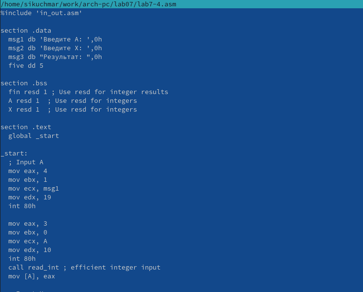{#fig:113 width=70%}

Создадим исполняемый файл и запустим его для значений Варианта 6: x1=2, a1=1, x2=2, a2=1 (рис. [-@fig:114]).

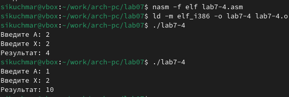{#fig:114 width=70%}

# Выводы

В рамках данной работы были успешно освоены основы работы с ассемблером NASM. Были освоены разные операции с переменными, такие как сравнение и вычисление наибольшего и наименьшего в NASM и создание программ для вычисления выражений.
    

